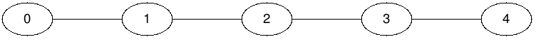

For the purposes of this problem, suppose that Quora has `n` questions, and question `i` takes `ti` time to read. Some questions are related to each other. If we connect related questions by edges, we get an undirected graph such that there exists exactly one path from any question to another. In other words, the graph of related questions is a tree.

Every time Steve reads a question, he will see a list of questions that are directly related to it and will navigate at random to one that he hasn't read yet (all related questions have an equal chance of being viewed). Steve will stop reading once there are no unread related questions left.

Given the number of related questions `n`, an array that contains the estimated reading time for each question `t`, and an array containing the pairs of related questions `edges`, which question should we show to Steve first so that we minimize his total expected reading time? It is guaranteed that there is one unique question that is optimal.

Here's how the total expected time for question `i` with `q` related questions is calculated:

 * Take the time `ti` that it will take Steve to read this question;
 * Recursively calculate the `expected_timej` for each related question `j` without considering the `ith` question;
 * Add to `ti` the sum of `expected_timej` for each `j`, divided by `q`, i.e. the answer will be equal to `ti + sum(expected_timej) / q`.

**Example**

For `n = 5`, `t = [2, 2, 1, 2, 2]` and `edges = [[0, 1], [1, 2], [2, 3], [3, 4]]`, the output should be
`relatedQuestions(n, t, edges) = 2`.

For this example, the tree can be visualized as:

Let's calculate the answers for each of the `5` vertices:

 * If Steve starts reading from question `0`, then the expected reading time equals `t0 + expected_time1 / 1 = t0 + (t1 + expected_time2 / 1) / 1 = ... = t0 + (t1 + (t2 + (t3 + (t4 + 0 / 1) / 1) / 1) / 1) / 1 = t0 + t1 + t2 + t3 + t4 = 2 + 2 + 1 + 2 + 2 = 9`.
 * If Steve starts reading from question `1`, then the expected reading time equals `t1 + (expected_time0 + expected_time2) / 2 = t1 + ((t0 + 0 / 1) + (t2 + expected_time3 / 1)) / 2 = t1 + (t0 + t2 + (t3 + (t4 + 0 / 1) / 1) / 1) / 2 = t1 + (t0 + t2 + t3 + t4) / 2 = 2 + (2 + 1 + 2 + 2) / 2 = 5.5`.
 * If Steve starts reading from question `2`, then the expected reading time equals `t2 + (expected_time1 + expected_time3) / 2 = t2 + ((t1 + expected_time0 / 1) + (t3 + expected_time4 / 1)) / 2 = t2 + ((t1 + t0) + (t3 + t4)) / 2 = t2 + (t1 + t0 + t3 + t4) / 2 = 1 + (2 + 2 + 2 + 2) / 2 = 5`.
 * The expected reading time for vertex `3` is equal to the expected reading time for vertex `1`, because they are symmetric in the tree. The same works for vertices `4` and `0`.

So, as we can see, the optimal vertex to start with is vertex `2`, since that gives us the smallest expected reading time.