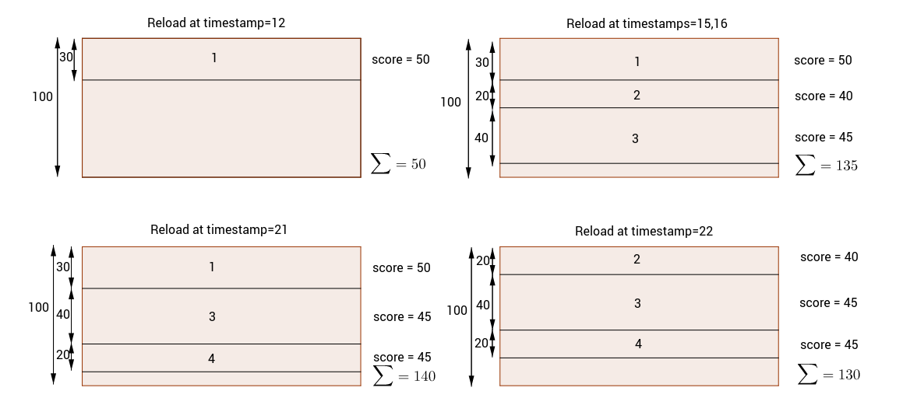

Quora shows a customized feed of recent stories on a user's home page. Stories in Quora refer to activities that happen on the site, such as when a user adds a question or upvotes an answer. Every story has a score, which represents the value that the story brings to the user. The goal is to quickly generate a feed of the best and most recent stories for the user every time they reload their Quora home page.

Your task is to design the algorithm that picks the stories that are displayed in this feed.

You are given a list of stories that, for each story, contains: the time the story was published, the story's score, and the height in pixels that it takes to display the story. Given the total number of pixels h that are available for displaying the story feed in the browser, you want to maximize the sum of the scores for the stories that you can display in the feed every time the user reloads their home page. You can only consider recent stories, so a story can be displayed at any given moment only if it was posted no longer than span units of time before that moment. You do not have to use up all the pixels available in the browser.

For each reload event, return an array where the first element is the best available sum of scores, and the other elements are the set of story IDs that correspond to that score sum. The IDs should be returned in ascending order. The answer arrays should be ordered by their corresponding reload event times.

If two sets of stories have the same score, choose the set that contains fewer stories. If there is still a tie, choose the set which has the lexicographically smaller set of IDs.

**Example**

For `span = 10`, `h = 100` and

```
events = [[11, 50, 30], 
          [12],
          [13, 40, 20],
          [14, 45, 40],
          [15],
          [16],
          [18, 45, 20],
          [21],
          [22]]
```

the output should be

```
feedOptimizer(span, h, events) = [[50, 1],
                                  [135, 1, 2, 3],
                                  [135, 1, 2, 3],
                                  [140, 1, 3, 4],
                                  [130, 2, 3, 4]]
```


There are 4 stories (with IDs 1 to 4) and 5 reload events.

 * At the first reload, there is only one story (ID = 1) with score of 50 available for display;
 * After the next two reloads, there are 3 stories that take up 90 of the 100 pixels available, for a total score of 135;
 * After reloading at time 21, there are 4 stories available to choose from, but only 3 will fit into the browser height. The best set is `[1, 3, 4]` for a total score of 140;
 * At the last reload event, you can no longer consider story 1 when choosing stories because it is more than 10 time units old.

The best set of scores is thus `[2, 3, 4]`.

For a good visualization of this, check out the image below:

